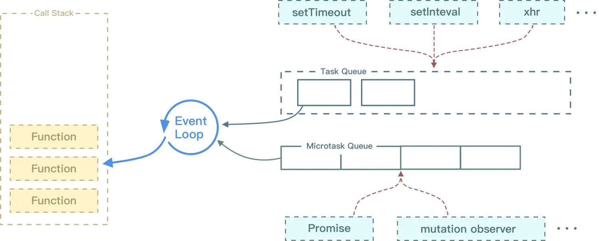
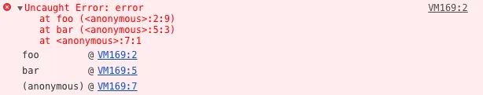
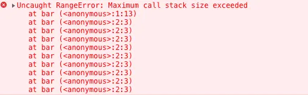
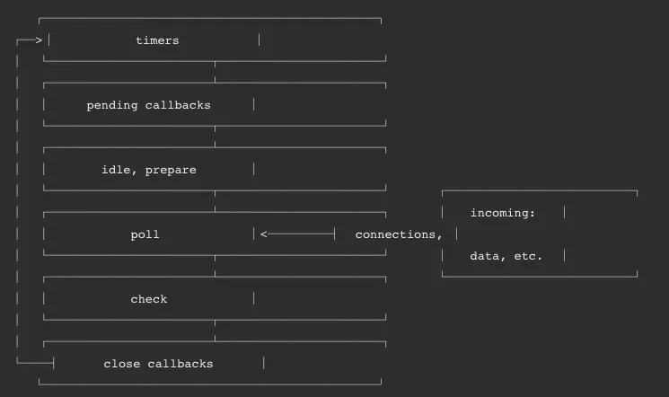
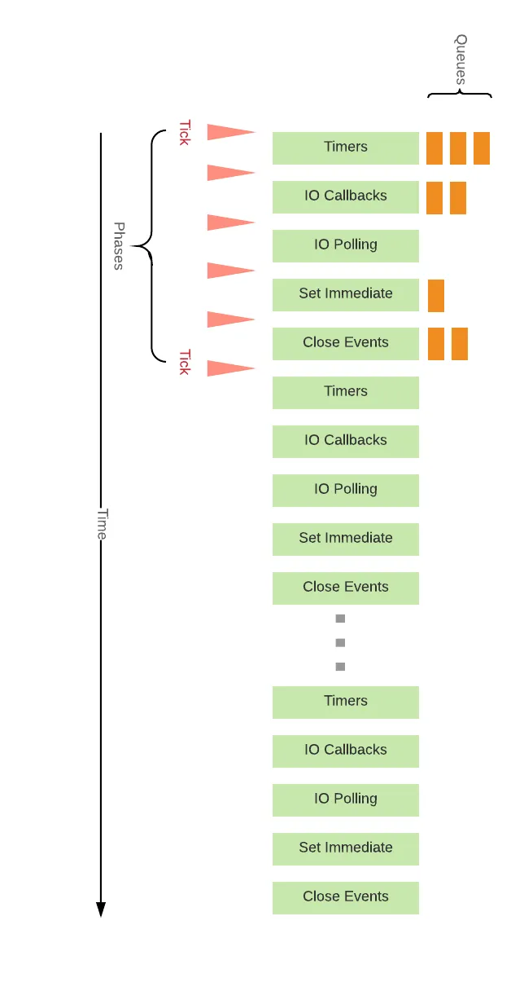

## 八、浏览器事件机制

### 1. 事件是什么？事件模型？

事件是用户操作网页时发生的交互动作，比如 click/move， 事件除了用户触发的动作外，还可以是文档加载，窗口滚动和大小调整。事件被封装成一个 event 对象，包含了该事件发生时的所有相关信息（ event 的属性）以及可以对事件进行的操作（ event 的方法）。

事件是用户操作网页时发生的交互动作或者网页本身的一些操作，现代浏览器一共有三种事件模型：

- **DOM0 级事件模型**，这种模型不会传播，所以没有事件流的概念，但是现在有的浏览器支持以冒泡的方式实现，它可以在网页中直接定义监听函数，也可以通过 js 属性来指定监听函数。所有浏览器都兼容这种方式。直接在dom对象上注册事件名称，就是DOM0写法。
- **IE 事件模型**，在该事件模型中，一次事件共有两个过程，事件处理阶段和事件冒泡阶段。事件处理阶段会首先执行目标元素绑定的监听事件。然后是事件冒泡阶段，冒泡指的是事件从目标元素冒泡到 document，依次检查经过的节点是否绑定了事件监听函数，如果有则执行。这种模型通过attachEvent 来添加监听函数，可以添加多个监听函数，会按顺序依次执行。
- **DOM2 级事件模型**，在该事件模型中，一次事件共有三个过程，第一个过程是事件捕获阶段。捕获指的是事件从 document 一直向下传播到目标元素，依次检查经过的节点是否绑定了事件监听函数，如果有则执行。后面两个阶段和 IE 事件模型的两个阶段相同。这种事件模型，事件绑定的函数是addEventListener，其中第三个参数可以指定事件是否在捕获阶段执行。

### 2. 如何阻止事件冒泡

- 普通浏览器使用：event.stopPropagation()
- IE浏览器使用：event.cancelBubble = true;

### 3. 对事件委托的理解

#### （1）事件委托的概念

事件委托本质上是利用了**浏览器事件冒泡**的机制。因为事件在冒泡过程中会上传到父节点，父节点可以通过事件对象获取到目标节点，因此可以把子节点的监听函数定义在父节点上，由父节点的监听函数统一处理多个子元素的事件，这种方式称为事件委托（事件代理）。

使用事件委托可以不必要为每一个子元素都绑定一个监听事件，这样减少了内存上的消耗。并且使用事件代理还可以实现事件的动态绑定，比如说新增了一个子节点，并不需要单独地为它添加一个监听事件，它绑定的事件会交给父元素中的监听函数来处理。

#### （2）事件委托的特点
- **减少内存消耗**

如果有一个列表，列表之中有大量的列表项，需要在点击列表项的时候响应一个事件：
```html
<ul id="list">
  <li>item 1</li>
  <li>item 2</li>
  <li>item 3</li>
  ......
  <li>item n</li>
</ul>
```
如果给每个列表项一一都绑定一个函数，那对于内存消耗是非常大的，效率上需要消耗很多性能。因此，比较好的方法就是把这个点击事件绑定到他的父层，也就是 ul 上，然后在执行事件时再去匹配判断目标元素，所以事件委托可以减少大量的内存消耗，节约效率。

- **动态绑定事件**

给上述的例子中每个列表项都绑定事件，在很多时候，需要通过 AJAX 或者用户操作动态的增加或者去除列表项元素，那么在每一次改变的时候都需要重新给新增的元素绑定事件，给即将删去的元素解绑事件；如果用了事件委托就没有这种麻烦了，因为事件是绑定在父层的，和目标元素的增减是没有关系的，执行到目标元素是在真正响应执行事件函数的过程中去匹配的，所以使用事件在动态绑定事件的情况下是可以减少很多重复工作的。
```js
// 来实现把 #list 下的 li 元素的事件代理委托到它的父层元素也就是 #list 上：
// 给父层元素绑定事件
document.getElementById('list').addEventListener('click', function (e) {
  // 兼容性处理
  var event = e || window.event;
  var target = event.target || event.srcElement;
  // 判断是否匹配目标元素
  if (target.nodeName.toLocaleLowerCase === 'li') {
    console.log('the content is: ', target.innerHTML);
  }
});
```

#### （3）局限性
当然，事件委托也是有局限的。比如 focus、blur 之类的事件没有事件冒泡机制，所以无法实现事件委托；mousemove、mouseout 这样的事件，虽然有事件冒泡，但是只能不断通过位置去计算定位，对性能消耗高，因此也是不适合于事件委托的。

当然事件委托不是只有优点，它也是有**缺点**的，事件委托会影响页面性能，主要影响因素有：

- 元素中，绑定事件委托的次数；
- 点击的最底层元素，到绑定事件元素之间的`DOM`层数；

在必须使用事件委托的地方，可以进行如下的处理：

- 只在必须的地方，使用事件委托，比如：`ajax`的局部刷新区域
- 尽量的减少绑定的层级，不在`body`元素上，进行绑定
- 减少绑定的次数，如果可以，那么把多个事件的绑定，合并到一次事件委托中去，由这个事件委托的回调，来进行分发。

### 4. 事件委托的使用场景

场景：给页面的所有的a标签添加click事件，代码如下：

```js
document.addEventListener("click", function(e) {
  if (e.target.nodeName == "A")
    console.log("a");
}, false);
```

但是这些a标签可能包含一些像span、img等元素，如果点击到了这些a标签中的元素，就不会触发click事件，因为事件绑定上在a标签元素上，而触发这些内部的元素时，e.target指向的是触发click事件的元素（span、img等其他元素）。  

这种情况下就可以使用事件委托来处理，将事件绑定在a标签的内部元素上，当点击它的时候，就会逐级向上查找，知道找到a标签为止，代码如下：

```js
document.addEventListener("click", function(e) {
  var node = e.target;
  while (node.parentNode.nodeName != "BODY") {
    if (node.nodeName == "A") {
      console.log("a");
      break;
    }
    node = node.parentNode;
  }
}, false);
```

### 5. 同步和异步的区别
- **同步** 指的是当一个进程在执行某个请求时，如果这个请求需要等待一段时间才能返回，那么这个进程会一直等待下去，直到消息返回为止再继续向下执行。
- **异步** 指的是当一个进程在执行某个请求时，如果这个请求需要等待一段时间才能返回，这个时候进程会继续往下执行，不会阻塞等待消息的返回，当消息返回时系统再通知进程进行处理。

### 6. 对事件循环的理解
因为 js 是单线程运行的，在代码执行时，通过将不同函数的执行上下文压入执行栈中来保证代码的有序执行。在执行同步代码时，如果遇到异步事件，js 引擎并不会一直等待其返回结果，而是会将这个事件挂起，继续执行执行栈中的其他任务。当异步事件执行完毕后，再将异步事件对应的回调加入到一个任务队列中等待执行。任务队列可以分为宏任务队列和微任务队列，当当前执行栈中的事件执行完毕后，js 引擎首先会判断微任务队列中是否有任务可以执行，如果有就将微任务队首的事件压入栈中执行。当微任务队列中的任务都执行完成后再去执行宏任务队列中的任务。



Event Loop 执行顺序如下所示：

- 首先执行同步代码，这属于宏任务
- 当执行完所有同步代码后，执行栈为空，查询是否有异步代码需要执行
- 执行所有微任务
- 当执行完所有微任务后，如有必要会渲染页面
- 然后开始下一轮 Event Loop，执行宏任务中的异步代码

### 7. 宏任务和微任务分别有哪些
- 微任务包括： promise 的回调、node 中的 process.nextTick 、对 Dom 变化监听的 MutationObserver。
- 宏任务包括： script 脚本的执行、setTimeout ，setInterval ，setImmediate 一类的定时事件，还有如 I/O 操作、UI 渲染等。

### 8. 什么是执行栈
可以把执行栈认为是一个存储函数调用的**栈结构**，遵循先进后出的原则。


当开始执行 JS 代码时，根据先进后出的原则，后执行的函数会先弹出栈，可以看到，foo 函数后执行，当执行完毕后就从栈中弹出了。

平时在开发中，可以在报错中找到执行栈的痕迹：
```js
function foo() {
  throw new Error('error')
}
function bar() {
  foo()
}
bar()
```


可以看到报错在 foo 函数，foo 函数又是在 bar 函数中调用的。当使用递归时，因为栈可存放的函数是有限制的，一旦存放了过多的函数且没有得到释放的话，就会出现爆栈的问题
```js
function bar() {
  bar()
}
bar()
```


### 9. Node 中的 Event Loop 和浏览器中的有什么区别？process.nextTick 执行顺序？
Node 中的 Event Loop 和浏览器中的是完全不相同的东西。

Node 的 Event Loop 分为 6 个阶段，它们会按照顺序反复运行。每当进入某一个阶段的时候，都会从对应的回调队列中取出函数去执行。当队列为空或者执行的回调函数数量到达系统设定的阈值，就会进入下一阶段。



（1）**Timers（计时器阶段）**：初次进入事件循环，会从计时器阶段开始。此阶段会判断是否存在过期的计时器回调（包含 setTimeout 和 setInterval），如果存在则会执行所有过期的计时器回调，执行完毕后，如果回调中触发了相应的微任务，会接着执行所有微任务，执行完微任务后再进入 Pending callbacks 阶段。

（2）**Pending callbacks**：执行推迟到下一个循环迭代的I / O回调（系统调用相关的回调）。

（3）**Idle/Prepare**：仅供内部使用。

（4）**Poll（轮询阶段）**：

- 当回调队列不为空时：会执行回调，若回调中触发了相应的微任务，这里的微任务执行时机和其他地方有所不同，不会等到所有回调执行完毕后才执行，而是针对每一个回调执行完毕后，就执行相应微任务。执行完所有的回调后，变为下面的情况。
- 当回调队列为空时（没有回调或所有回调执行完毕）：但如果存在有计时器（setTimeout、setInterval和setImmediate）没有执行，会结束轮询阶段，进入 Check 阶段。否则会阻塞并等待任何正在执行的I/O操作完成，并马上执行相应的回调，直到所有回调执行完毕。

（5）**Check（查询阶段）**：会检查是否存在 setImmediate 相关的回调，如果存在则执行所有回调，执行完毕后，如果回调中触发了相应的微任务，会接着执行所有微任务，执行完微任务后再进入 Close callbacks 阶段。

（6）**Close callbacks**：执行一些关闭回调，比如socket.on('close', ...)等。

下面来看一个例子，首先在有些情况下，定时器的执行顺序其实是**随机**的
```js
setTimeout(() => {
  console.log('setTimeout')
}, 0)
setImmediate(() => {
  console.log('setImmediate')
})
```
对于以上代码来说，setTimeout 可能执行在前，也可能执行在后

- 首先 setTimeout(fn, 0) === setTimeout(fn, 1)，这是由源码决定的
- 进入事件循环也是需要成本的，如果在准备时候花费了大于 1ms 的时间，那么在 timer 阶段就会直接执行 setTimeout 回调
- 那么如果准备时间花费小于 1ms，那么就是 setImmediate 回调先执行了

当然在某些情况下，他们的执行顺序一定是固定的，比如以下代码：
```js
const fs = require('fs')
fs.readFile(__filename, () => {
  setTimeout(() => {
    console.log('timeout');
  }, 0)
  setImmediate(() => {
    console.log('immediate')
  })
})
```
在上述代码中，`setImmediate` 永远**先执行**。因为两个代码写在 IO 回调中，IO 回调是在 poll 阶段执行，当回调执行完毕后队列为空，发现存在 `setImmediate` 回调，所以就直接跳转到 check 阶段去执行回调了。

上面都是 macrotask 的执行情况，对于 microtask 来说，它会在以上每个阶段完成前**清空** microtask 队列，下图中的 Tick 就代表了 microtask



```js
setTimeout(() => {
  console.log('timer21')
}, 0)
Promise.resolve().then(function() {
  console.log('promise1')
})
```
对于以上代码来说，其实和浏览器中的输出是一样的，microtask 永远执行在 macrotask 前面。

最后来看 Node 中的 `process.nextTick`，这个函数其实是独立于 Event Loop 之外的，它有一个自己的队列，当每个阶段完成后，如果存在 nextTick 队列，就会**清空队列中的所有回调函数**，并且优先于其他 microtask 执行。

```js
setTimeout(() => {
 console.log('timer1')
 Promise.resolve().then(function() {
   console.log('promise1')
 })
}, 0)
process.nextTick(() => {
 console.log('nextTick')
 process.nextTick(() => {
   console.log('nextTick')
   process.nextTick(() => {
     console.log('nextTick')
     process.nextTick(() => {
       console.log('nextTick')
     })
   })
 })
})
```
对于以上代码，永远都是先把 nextTick 全部打印出来。

### 10. 事件触发的过程是怎样的
事件触发有三个阶段：
- `window` 往事件触发处传播，遇到注册的捕获事件会触发
- 传播到事件触发处时触发注册的事件
- 从事件触发处往 `window` 传播，遇到注册的冒泡事件会触发

事件触发一般来说会按照上面的顺序进行，但是也有特例，**如果给一个 `body` 中的子节点同时注册冒泡和捕获事件，事件触发会按照注册的顺序执行**。

```js
// 以下会先打印冒泡然后是捕获
node.addEventListener('click', event => {
  console.log('冒泡')
}, false )
node.addEventListener('click', event => {
  console.log('捕获 ')
}, true)
```

通常使用 `addEventListener` 注册事件，该函数的第三个参数可以是布尔值，也可以是对象。对于布尔值 useCapture 参数来说，该参数默认值为 `false` `，useCapture` 决定了注册的事件是捕获事件还是冒泡事件。对于对象参数来说，可以使用以下几个属性：

- `capture`：布尔值，和 useCapture 作用一样
- `once`：布尔值，值为 true 表示该回调只会调用一次，调用后会移除监听
- `passive`：布尔值，表示永远不会调用 preventDefault

一般来说，如果只希望事件只触发在目标上，这时候可以使用 `stopPropagation` 来阻止事件的进一步传播。通常认为 `stopPropagation` 是用来阻止事件冒泡的，其实该函数也可以阻止捕获事件。

`stopImmediatePropagation` 同样也能实现阻止事件，但是还能阻止该事件目标执行别的注册事件。

```js
node.addEventListener('click', event => {
  event.stopImmediatePropagation()
  console.log('冒泡')
}, false)
// 点击 node 只会执行上面的函数，该函数不会执行
node.addEventListener('click', event => {
  console.log('捕获 ')
}, true )
```