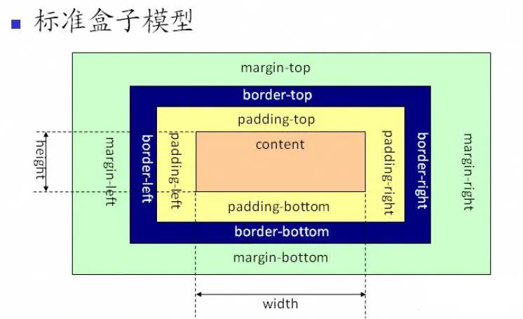
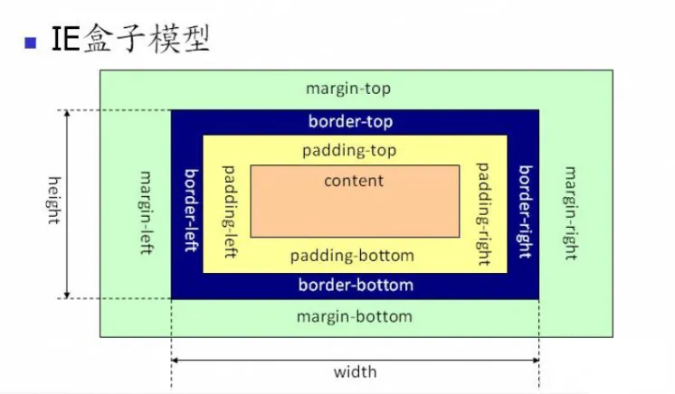

# CSS

## 1. 分析比较 opacity: 0、visibility: hidden、display: none 优劣和适用场景。

|        |                        display:none                         |                 visibility: hidden                  |            opacity: 0            |
| :----: | :---------------------------------------------------------: | :-------------------------------------------------: | :------------------------------: |
| 结构： |                  不占据任何空间, 不能点击                     |          占据空间，只是内容不可见，不能点击            |   占据空间，只是内容不可见，可以点击 |
| 继承： |                         非继承属性                           |           继承属性,可修改子孙节点该属性显示            |             非继承属性            |
| 性能： |   修改元素会造成文档回流,读屏器不会读取元素内容，性能消耗较大    |  修改元素只会造成本元素的重绘,性能消耗较少，读屏器读取   |   修改元素会造成重绘，性能消耗较少   |
|  场景  |                 显示出原来这里不存在的结构                    |         显示不会导致页面结构发生变动，不会撑开          |      可以跟 transition 搭配       |

## 2. 如何用 css 或 js 实现多行文本溢出省略效果，考虑兼容性

CSS 实现方式<br>
单行：

```css
p {
	overflow: hidden;
	text-overflow: ellipsis;
	white-space: nowrap;
}
```

多行：

```css
p {
	display: -webkit-box;
	-webkit-box-orient: vertical;
	-webkit-line-clamp: 3; //行数
	overflow: hidden;
}
```

兼容：

```css
p {
	position: relative;
	line-height: 20px;
	max-height: 40px;
	overflow: hidden;
}
p::after {
	content: "...";
	position: absolute;
	bottom: 0;
	right: 0;
	padding-left: 40px;
	background: -webkit-linear-gradient(left, transparent, #fff 55%);
	background: -o-linear-gradient(right, transparent, #fff 55%);
	background: -moz-linear-gradient(right, transparent, #fff 55%);
	background: linear-gradient(to right, transparent, #fff 55%);
}
```

JS 实现方式：

- 使用 split + 正则表达式将单词与单个文字切割出来存入 words
- 加上 '...'
- 判断 scrollHeight 与 clientHeight，超出的话就从 words 中 pop 一个出来

## 3. 居中为什么要使用 transform（为什么不使用 marginLeft/Top）（阿里）

transform 属于合成属性（composite property），对合成属性进行 transition/animation 动画将会创建一个合成层（composite layer），这使得被动画元素在一个独立的层中进行动画。通常情况下，浏览器会将一个层的内容先绘制进一个位图中，然后再作为纹理（texture）上传到 GPU，只要该层的内容不发生改变，就没必要进行重绘（repaint），浏览器会通过重新复合（recomposite）来形成一个新的帧。
<br>
top/left 属于布局属性，该属性的变化会导致重排（reflow/relayout），所谓重排即指对这些节点以及受这些节点影响的其它节点，进行 CSS 计算->布局->重绘过程，浏览器需要为整个层进行重绘并重新上传到 GPU，造成了极大的性能开销。

## 4. 介绍下粘性布局（sticky）（网易）

position 中的 sticky 值是 CSS3 新增的，设置了 sticky 值后，在屏幕范围（viewport）时该元素的位置并不受到定位影响（设置是 top、left 等属性无效），当该元素的位置将要移出偏移范围时，定位又会变成 fixed，根据设置的 left、top 等属性成固定位置的效果。<br>
sticky 属性值有以下几个特点：

- 该元素并不脱离文档流，仍然保留元素原本在文档流中的位置。
- 当元素在容器中被滚动超过指定的偏移值时，元素在容器内固定在指定位置。亦即如果你设置了 top: 50px，那么在 sticky 元素到达距离相对定位的元素顶部 50px 的位置时固定，不再向上移动。
- 元素固定的相对偏移是相对于离它最近的具有滚动框的祖先元素，如果祖先元素都不可以滚动，那么是相对于 viewport 来计算元素的偏移量

## 5. 说出 space-between 和 space-around 的区别？（携程）

这个是 flex 布局的内容，其实就是一个边距的区别，按水平布局来说，space-between 是两端对齐，在左右两侧没有边距，而 space-around 是每个 子项目左右方向的 margin 相等，所以两个 item 中间的间距会比较大。

## 6. CSS3 中 transition 和 animation 的属性分别有哪些（哔哩哔哩）

transition 过渡动画：

- transition-property：指定过渡的 CSS 属性
- transition-duration：指定过渡所需的完成时间
- transition-timing-function：指定过渡函数
- transition-delay：指定过渡的延迟时间
  animation 关键帧动画：
- animation-name：指定要绑定到选择器的关键帧的名称
- animation-duration：动画指定需要多少秒或毫秒完成
- animation-timing-function：设置动画将如何完成一个周期
- animation-delay：设置动画在启动前的延迟间隔
- animation-iteration-count：定义动画的播放次数
- animation-direction：指定是否应该轮流反向播放动画
- animation-fill-mode：规定当动画不播放时（当动画完成时，或当动画有一个延迟未开始播放时），要应用到元素的样式
- animation-play-state：指定动画是否正在运行或已暂停

## 7. 讲一下png8、png16、png32的区别，并简单讲讲 png 的压缩原理
PNG图片主要有三个类型，分别为 PNG 8/ PNG 24 / PNG 32。
- PNG 8：PNG 8中的8，其实指的是8bits，相当于用2^8（2的8次方）大小来存储一张图片的颜色种类，2^8等于256，也就是说PNG 8能存储256种颜色，一张图片如果颜色种类很少，将它设置成PNG 8得图片类型是非常适合的。
- PNG 24：PNG 24中的24，相当于3乘以8 等于 24，就是用三个8bits分别去表示 R（红）、G（绿）、B（蓝）。R(0-255),G(0-255),B(0-255)，可以表达256乘以256乘以256=16777216种颜色的图片，这样PNG 24就能比PNG 8表示色彩更丰富的图片。但是所占用的空间相对就更大了。
- PNG 32：PNG 32中的32，相当于PNG 24 加上 8bits的透明颜色通道，就相当于R（红）、G（绿）、B（蓝）、A（透明）。R(0255),G(0255),B(0255),A(0255)。比PNG 24多了一个A（透明），也就是说PNG 32能表示跟PNG 24一样多的色彩，并且还支持256种透明的颜色，能表示更加丰富的图片颜色类型。
PNG图片的压缩，分两个阶段：
- 预解析（Prediction）：这个阶段就是对png图片进行一个预处理，处理后让它更方便后续的压缩。
- 压缩（Compression）：执行Deflate压缩，该算法结合了 LZ77 算法和 Huffman 算法对图片进行编码。

## 8. 如何触发重排和重绘？
任何改变用来构建渲染树的信息都会导致一次重排或重绘：
- 添加、删除、更新DOM节点
- 通过display: none隐藏一个DOM节点-触发重排和重绘
- 通过visibility: hidden隐藏一个DOM节点-只触发重绘，因为没有几何变化
- 移动或者给页面中的DOM节点添加动画
- 添加一个样式表，调整样式属性
- 用户行为，例如调整窗口大小，改变字号，或者滚动。

## 9. 重绘与重排的区别？
**重排**: 部分渲染树（或者整个渲染树）需要重新分析并且节点尺寸需要重新计算，表现为重新生成布局，重新排列元素

**重绘**: 由于节点的几何属性发生改变或者由于样式发生改变，例如改变元素背景色时，屏幕上的部分内容需要更新，表现为某些元素的外观被改变

单单改变元素的外观，肯定不会引起网页重新生成布局，但当浏览器完成重排之后，将会重新绘制受到此次重排影响的部分
重排和重绘代价是高昂的，它们会破坏用户体验，并且让UI展示非常迟缓，而相比之下重排的性能影响更大，在两者无法避免的情况下，一般我们宁可选择代价更小的重绘。
『重绘』不一定会出现『重排』，『重排』必然会出现『重绘』。

## 10. 如何优化图片
1. 对于很多装饰类图片，尽量不用图片，因为这类修饰图片完全可以用 CSS 去代替。
2. 对于移动端来说，屏幕宽度就那么点，完全没有必要去加载原图浪费带宽。一般图片都用 CDN 加载，可以计算出适配屏幕的宽度，然后去请求相应裁剪好的图片。
3. 小图使用 base64 格式
4. 将多个图标文件整合到一张图片中（雪碧图）
5. 选择正确的图片格式：
	- 对于能够显示 WebP 格式的浏览器尽量使用 WebP 格式。因为 WebP 格式具有更好的图像数据压缩算法，能带来更小的图片体积，而且拥有肉眼识别无差异的图像质量，缺点就是兼容性并不好
	- 小图使用 PNG，其实对于大部分图标这类图片，完全可以使用 SVG 代替
	- 照片使用 JPEG

## 11. 你能描述一下渐进增强和优雅降级之间的不同吗?
**渐进增强 （progressive enhancement）**：针对低版本浏览器进行构建页面，保证最基本的功能，然后再针对高级浏览器进行效果、交互等改进和追加功能达到更好的用户体验。

**优雅降级 （graceful degradation）**：一开始就构建完整的功能，然后再针对低版本浏览器进行兼容。
区别：优雅降级是从复杂的现状开始，并试图减少用户体验的供给，而渐进增强则是从一个非常基础的，能够起作用的版本开始，并不断扩充，以适应未来环境的需要。降级（功能衰减）意味着往回看；而渐进增强则意味着朝前看，同时保证其根基处于安全地带。

## 12. link和@import的区别
两者都是外部引用CSS的方式，它们的区别如下：

- link是XHTML标签，除了加载CSS外，还可以定义RSS等其他事务；@import属于CSS范畴，只能加载CSS。
- link引用CSS时，在页面载入时同时加载；@import需要页面网页完全载入以后加载。
- link是XHTML标签，无兼容问题；@import是在CSS2.1提出的，低版本的浏览器不支持。
- link支持使用Javascript控制DOM去改变样式；而@import不支持。

## 13. transition和animation的区别
- **transition是过度属性**，强调过度，它的实现需要触发一个事件（比如鼠标移动上去，焦点，点击等）才执行动画。它类似于flash的补间动画，设置一个开始关键帧，一个结束关键帧。
- **animation是动画属性**，它的实现不需要触发事件，设定好时间之后可以自己执行，且可以循环一个动画。它也类似于flash的补间动画，但是它可以设置多个关键帧（用@keyframe定义）完成动画。

## 14. 伪元素和伪类的区别和作用？
- **伪元素**：在内容元素的前后插入额外的元素或样式，但是这些元素实际上并不在文档中生成。它们只在外部显示可见，但不会在文档的源代码中找到它们，因此，称为“伪”元素。例如：
```css
p::before {content:"第一章：";}
p::after {content:"Hot!";}
p::first-line {background:red;}
p::first-letter {font-size:30px;}
```
- **伪类**：将特殊的效果添加到特定选择器上。它是已有元素上添加类别的，不会产生新的元素。例如：
```css
a:hover {color: #FF00FF}
p:first-child {color: red}
```
**总结**：伪类是通过在元素选择器上加⼊伪类改变元素状态，⽽伪元素通过对元素的操作进⾏对元素的改变。

## 15. 对requestAnimationframe的理解
实现动画效果的方法比较多，Javascript 中可以通过定时器 setTimeout 来实现，CSS3 中可以使用 transition 和 animation 来实现，HTML5 中的 canvas 也可以实现。除此之外，HTML5 提供一个专门用于请求动画的API，那就是 requestAnimationFrame，顾名思义就是**请求动画帧**。

MDN对该方法的描述：

> window.requestAnimationFrame() 告诉浏览器——你希望执行一个动画，并且要求浏览器在下次重绘之前调用指定的回调函数更新动画。该方法需要传入一个回调函数作为参数，该回调函数会在浏览器下一次重绘之前执行。

**语法：** window.requestAnimationFrame(callback);  其中，callback是**下一次重绘之前更新动画帧所调用的函数**(即上面所说的回调函数)。该回调函数会被传入DOMHighResTimeStamp参数，它表示requestAnimationFrame() 开始去执行回调函数的时刻。该方法属于**宏任务**，所以会在执行完微任务之后再去执行。

**取消动画：** 使用cancelAnimationFrame()来取消执行动画，该方法接收一个参数——requestAnimationFrame默认返回的id，只需要传入这个id就可以取消动画了。

**优势：**

- **CPU节能：** 使用SetTinterval 实现的动画，当页面被隐藏或最小化时，SetTinterval 仍然在后台执行动画任务，由于此时页面处于不可见或不可用状态，刷新动画是没有意义的，完全是浪费CPU资源。而RequestAnimationFrame则完全不同，当页面处理未激活的状态下，该页面的屏幕刷新任务也会被系统暂停，因此跟着系统走的RequestAnimationFrame也会停止渲染，当页面被激活时，动画就从上次停留的地方继续执行，有效节省了CPU开销。
- **函数节流：** 在高频率事件( resize, scroll 等)中，为了防止在一个刷新间隔内发生多次函数执行，RequestAnimationFrame可保证每个刷新间隔内，函数只被执行一次，这样既能保证流畅性，也能更好的节省函数执行的开销，一个刷新间隔内函数执行多次时没有意义的，因为多数显示器每16.7ms刷新一次，多次绘制并不会在屏幕上体现出来。
- **减少DOM操作：** requestAnimationFrame 会把每一帧中的所有DOM操作集中起来，在一次重绘或回流中就完成，并且重绘或回流的时间间隔紧紧跟随浏览器的刷新频率，一般来说，这个频率为每秒60帧。

**setTimeout执行动画的缺点：** 它通过设定间隔时间来不断改变图像位置，达到动画效果。但是容易出现卡顿、抖动的现象；原因是：

- settimeout任务被放入异步队列，只有当主线程任务执行完后才会执行队列中的任务，因此实际执行时间总是比设定时间要晚；
- settimeout的固定时间间隔不一定与屏幕刷新间隔时间相同，会引起丢帧。


## 16. 对盒模型的理解
CSS3中的盒模型有以下两种：标准盒子模型、IE盒子模型




可以通过修改元素的box-sizing属性来改变元素的盒模型：

- box-sizeing: content-box表示标准盒模型（默认值）
- box-sizeing: border-box表示IE盒模型（怪异盒模型）

## 17. 为什么有时候⽤translate来改变位置⽽不是定位？
translate 是 transform 属性的⼀个值。改变transform或opacity不会触发浏览器重新布局（reflow）或重绘（repaint），只会触发复合（compositions）。⽽改变绝对定位会触发重新布局，进⽽触发重绘和复合。transform使浏览器为元素创建⼀个 GPU 图层，但改变绝对定位会使⽤到 CPU。 因此translate()更⾼效，可以缩短平滑动画的绘制时间。 ⽽translate改变位置时，元素依然会占据其原始空间，绝对定位就不会发⽣这种情况。

## 18. li 与 li 之间有看不见的空白间隔是什么原因引起的？如何解决？
浏览器会把inline内联元素间的空白字符（空格、换行、Tab等）渲染成一个空格。为了美观，通常是一个`<li>`放在一行，这导致`<li>`换行后产生换行字符，它变成一个空格，占用了一个字符的宽度。

**解决办法：**

（1）为`<li>`设置float:left。不足：有些容器是不能设置浮动，如左右切换的焦点图等。

（2）将所有`<li>`写在同一行。不足：代码不美观。

（3）将`<ul>`内的字符尺寸直接设为0，即font-size:0。不足：`<ul>`中的其他字符尺寸也被设为0，需要额外重新设定其他字符尺寸，且在Safari浏览器依然会出现空白间隔。

（4）消除`<ul>`的字符间隔letter-spacing:-8px，不足：这也设置了`<li>`内的字符间隔，因此需要将`<li>`内的字符间隔设为默认letter-spacing:normal。

## 19. 替换元素的概念及计算规则
通过修改某个属性值呈现的内容就可以被替换的元素就称为“替换元素”。

替换元素除了内容可替换这一特性以外，还有以下特性：

- **内容的外观不受页面上的CSS的影响：** 用专业的话讲就是在样式表现在CSS作用域之外。如何更改替换元素本身的外观需要类似appearance属性，或者浏览器自身暴露的一些样式接口。
- **有自己的尺寸：** 在Web中，很多替换元素在没有明确尺寸设定的情况下，其默认的尺寸（不包括边框）是300像素×150像素，如
- 在很多CSS属性上有自己的一套表现规则：比较具有代表性的就是vertical-align属性，对于替换元素和非替换元素，vertical-align属性值的解释是不一样的。比方说vertical-align的默认值的baseline，很简单的属性值，基线之意，被定义为字符x的下边缘，而替换元素的基线却被硬生生定义成了元素的下边缘。
- **所有的替换元素都是内联水平元素：** 也就是替换元素和替换元素、替换元素和文字都是可以在一行显示的。但是，替换元素默认的display值却是不一样的，有的是inline，有的是inline-block。

替换元素的尺寸从内而外分为三类：

- **固有尺寸：** 指的是替换内容原本的尺寸。例如，图片、视频作为一个独立文件存在的时候，都是有着自己的宽度和高度的。
- **HTML尺寸：** 只能通过HTML原生属性改变，这些HTML原生属性包括的width和height属性、的size属性。
- **CSS尺寸：** 特指可以通过CSS的width和height或者max-width/min-width和max-height/min-height设置的尺寸，对应盒尺寸中的content box。

这三层结构的计算规则具体如下：

（1）如果没有CSS尺寸和HTML尺寸，则使用固有尺寸作为最终的宽高。

（2）如果没有CSS尺寸，则使用HTML尺寸作为最终的宽高。

（3）如果有CSS尺寸，则最终尺寸由CSS属性决定。

（4）如果“固有尺寸”含有固有的宽高比例，同时仅设置了宽度或仅设置了高度，则元素依然按照固有的宽高比例显示。

（5）如果上面的条件都不符合，则最终宽度表现为300像素，高度为150像素。

（6）内联替换元素和块级替换元素使用上面同一套尺寸计算规则。

## 20. 常见的图片格式及使用场景
1. **BMP**，是无损的、既支持索引色也支持直接色的点阵图。这种图片格式几乎没有对数据进行压缩，所以BMP格式的图片通常是较大的文件。  
2. **GIF**是无损的、采用索引色的点阵图。采用LZW压缩算法进行编码。文件小，是GIF格式的优点，同时，GIF格式还具有支持动画以及透明的优点。但是GIF格式仅支持8bit的索引色，所以GIF格式适用于对色彩要求不高同时需要文件体积较小的场景。  
3. **JPEG**是有损的、采用直接色的点阵图。JPEG的图片的优点是采用了直接色，得益于更丰富的色彩，JPEG非常适合用来存储照片，与GIF相比，JPEG不适合用来存储企业Logo、线框类的图。因为有损压缩会导致图片模糊，而直接色的选用，又会导致图片文件较GIF更大。  
4. **PNG-8**是无损的、使用索引色的点阵图。PNG是一种比较新的图片格式，PNG-8是非常好的GIF格式替代者，在可能的情况下，应该尽可能的使用PNG-8而不是GIF，因为在相同的图片效果下，PNG-8具有更小的文件体积。除此之外，PNG-8还支持透明度的调节，而GIF并不支持。除非需要动画的支持，否则没有理由使用GIF而不是PNG-8。  
5. **PNG-24**是无损的、使用直接色的点阵图。PNG-24的优点在于它压缩了图片的数据，使得同样效果的图片，PNG-24格式的文件大小要比BMP小得多。当然，PNG24的图片还是要比JPEG、GIF、PNG-8大得多。  
6. **SVG**是无损的矢量图。SVG是矢量图意味着SVG图片由直线和曲线以及绘制它们的方法组成。当放大SVG图片时，看到的还是线和曲线，而不会出现像素点。SVG图片在放大时，不会失真，所以它适合用来绘制Logo、Icon等。  
7. **WebP**是谷歌开发的一种新图片格式，WebP是同时支持有损和无损压缩的、使用直接色的点阵图。从名字就可以看出来它是为Web而生的，什么叫为Web而生呢？就是说相同质量的图片，WebP具有更小的文件体积。现在网站上充满了大量的图片，如果能够降低每一个图片的文件大小，那么将大大减少浏览器和服务器之间的数据传输量，进而降低访问延迟，提升访问体验。目前只有Chrome浏览器和Opera浏览器支持WebP格式，兼容性不太好。  
	- 在无损压缩的情况下，相同质量的WebP图片，文件大小要比PNG小26%；
	- 在有损压缩的情况下，具有相同图片精度的WebP图片，文件大小要比JPEG小25%~34%；
	- WebP图片格式支持图片透明度，一个无损压缩的WebP图片，如果要支持透明度只需要22%的格外文件大小。

## 21. px 和 em 的区别
px全称pixel像素，是相对于屏幕分辨率而言的，它是一个绝对单位，但同时具有一定的相对性。因为在同一个设备上每个像素代表的物理长度是固定不变的，这点表现的是绝对性。但是在不同的设备之间每个设备像素所代表的物理长度是可以变化的，这点表现的是相对性
em是一个相对长度单位，具体的大小需要相对于父元素计算，比如父元素的字体大小为80px，那么子元素1em就表示大小和父元素一样为80px，0.5em就表示字体大小是父元素的一半为40px

## 22. vw、vh 是什么？
vw 和 vh 是 CSS3 新单位，即 view width 可视窗口宽度 和 view height 可视窗口高度。1vw 就等于可视窗口宽度的百分之一，1vh 就等于可视窗口高度的百分之一。

## 23. 介绍下 BFC 及其应用
所谓 BFC，指的是一个独立的布局环境，BFC 内部的元素布局与外部互不影响。
触发 BFC 的方式有很多，常见的有：
- 设置浮动
- *overflow* 设置为 *auto、scroll、hidden*
- *positon* 设置为 *absolute、fixed*

常见的 BFC 应用有：
- 解决浮动元素令父元素高度坍塌的问题
- 解决非浮动元素被浮动元素覆盖问题
- 解决外边距垂直方向重合的问题

## 24. 介绍下 BFC、IFC、GFC 和 FFC
- *BFC*：块级格式上下文，指的是一个独立的布局环境，BFC 内部的元素布局与外部互不影响。
- *IFC*：行内格式化上下文，将一块区域以行内元素的形式来格式化。
- *GFC*：网格布局格式化上下文，将一块区域以 grid 网格的形式来格式化
- *FFC*：弹性格式化上下文，将一块区域以弹性盒的形式来格式化

## 25. flex 布局如何使用？
flex 是 Flexible Box 的缩写，意为"弹性布局"。指定容器display: flex即可。  
容器有以下属性：flex-direction，flex-wrap，flex-flow，justify-content，align-items，align-content。  
- flex-direction属性决定主轴的方向；
- flex-wrap属性定义，如果一条轴线排不下，如何换行；
- flex-flow属性是flex-direction属性和flex-wrap属性的简写形式，默认值为row nowrap；
- justify-content属性定义了项目在主轴上的对齐方式。
- align-items属性定义项目在交叉轴上如何对齐。
- align-content属性定义了多根轴线的对齐方式。如果项目只有一根轴线，该属性不起作用。

项目（子元素）也有一些属性：order，flex-grow，flex-shrink，flex-basis，flex，align-self。
- order属性定义项目的排列顺序。数值越小，排列越靠前，默认为0。
- flex-grow属性定义项目的放大比例，默认为0，即如果存在剩余空间，也不放大。
- flex-shrink属性定义了项目的缩小比例，默认为1，即如果空间不足，该项目将缩小。
- flex-basis属性定义了在分配多余空间之前，项目占据的主轴空间（main size）。
- flex属性是flex-grow, flex-shrink 和 flex-basis的简写，默认值为0 1 auto。后两个属性可选。
- align-self 属性允许单个项目有与其他项目不一样的对齐方式，可覆盖 align-items 属性。默认值为 auto，表示继承父元素的align-items属性，如果没有父元素，则等同于stretch。
## 26. 实现一个三角形
盒子的border属性是由三角形组成的，下面看一个例子：
<Triangle />
<<< ./components/Triangle.vue{7,8,9,10}

**（1）三角1**
<Triangle1/>
<<< ./components/Triangle1.vue{7,8,9,10,11}

**（2）三角2**
<Triangle2/>
<<< ./components/Triangle2.vue{7,8,9,10}


## 27. 实现一个扇形
扇形的思路和三角形基本一致，就是多了一个圆角的样式，实现一个90°的扇形：
<Triangle3/>
<<< ./components/Triangle3.vue{7,8,9,10,11,12}

## 28. 画一条0.5px的线
思路是利用scale将高度缩放一半
<Line/>
<<< ./components/Line.vue{14}


<script setup>
import Triangle from "./components/Triangle.vue"
import Triangle1 from "./components/Triangle1.vue"
import Triangle2 from "./components/Triangle2.vue"
import Triangle3 from "./components/Triangle3.vue"
import Line from "./components/Line.vue"
</script>