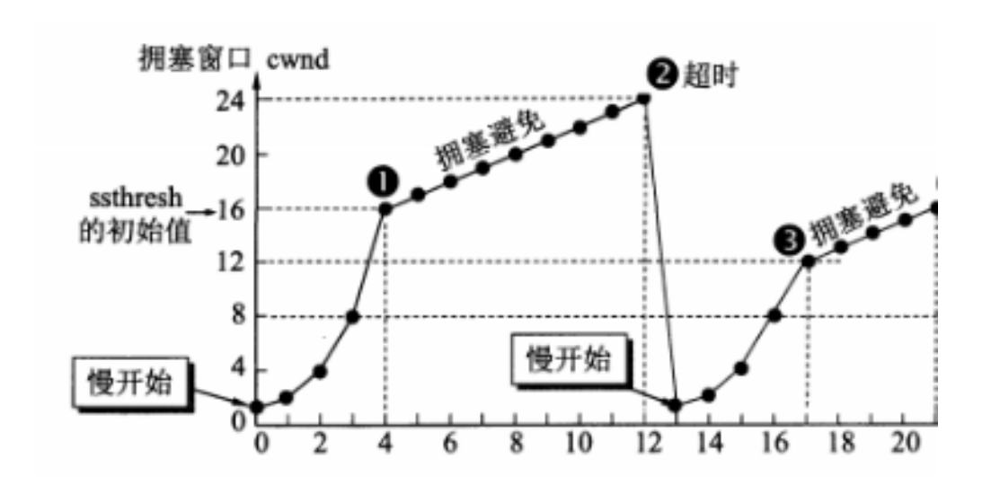
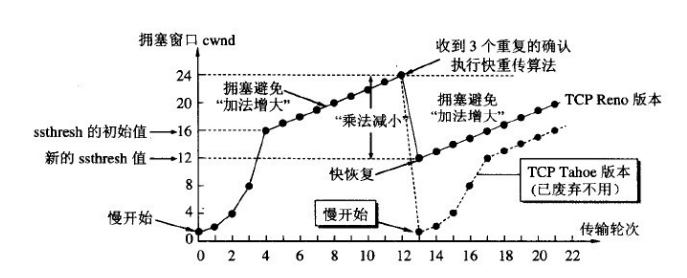

## 一、TCP与UDP

### 1、说一说三次握手
当面试官问你为什么需要有三次握手、三次握手的作用、讲讲三次三次握手的时候，我想很多人会这样回答：

首先很多人会先讲下握手的过程：

1、第一次握手：客户端给服务器发送一个 SYN 报文。  
2、第二次握手：服务器收到 SYN 报文之后，会应答一个 SYN+ACK 报文。  
3、第三次握手：客户端收到 SYN+ACK 报文之后，会回应一个 ACK 报文。  
4、服务器收到 ACK 报文之后，三次握手建立完成。  

作用是为了确认双方的接收与发送能力是否正常。

**这里我顺便解释一下为啥只有三次握手才能确认双方的接受与发送能力是否正常，而两次却不可以**：

- 第一次握手：客户端发送网络包，服务端收到了。这样服务端就能得出结论：客户端的发送能力、服务端的接收能力是正常的。  
- 第二次握手：服务端发包，客户端收到了。这样客户端就能得出结论：服务端的接收、发送能力，客户端的接收、发送能力是正常的。不过此时服务器并不能确认客户端的接收能力是否正常。  
- 第三次握手：客户端发包，服务端收到了。这样服务端就能得出结论：客户端的接收、发送能力正常，服务器自己的发送、接收能力也正常。  

因此，需要三次握手才能确认双方的接收与发送能力是否正常。  

这样回答其实也是可以的，但我觉得，这个过程的我们应该要描述的更详细一点，因为三次握手的过程中，双方是由很多状态的改变的，而这些状态，也是面试官可能会问的点。所以我觉得在回答三次握手的时候，我们应该要描述的详细一点，而且描述的详细一点意味着可以扯久一点。加分的描述我觉得应该是这样：

> **刚开始客户端处于 closed 的状态，服务端处于 listen 状态**。然后
> 1. 第一次握手：客户端给服务端发一个 SYN 报文，并指明客户端的初始化序列号 ISN(c)。此时客户端处于 SYN_Send 状态。
> 2. 第二次握手：服务器收到客户端的 SYN 报文之后，会以自己的 SYN 报文作为应答，并且也是指定了自己的初始化序列号 ISN(s)，同时会把客户端的 ISN + 1 作为 ACK 的值，表示自己已经收到了客户端的 SYN，此时服务器处于 SYN_REVD 的状态。
> 3. 第三次握手：客户端收到 SYN 报文之后，会发送一个 ACK 报文，当然，也是一样把服务器的 ISN + 1 作为 ACK 的值，表示已经收到了服务端的 SYN 报文，此时客户端处于 establised 状态。
> 4. 服务器收到 ACK 报文之后，也处于 establised 状态，此时，双方以建立起了链接


**三次握手的作用**

三次握手的作用也是有好多的，多记住几个，保证不亏。例如：  
1、确认双方的接受能力、发送能力是否正常。  
2、指定自己的初始化序列号，为后面的可靠传送做准备。

**1、（ISN）是固定的吗**

三次握手的一个重要功能是客户端和服务端交换ISN(Initial Sequence Number), 以便让对方知道接下来接收数据的时候如何按序列号组装数据。

如果ISN是固定的，攻击者很容易猜出后续的确认号，因此 ISN 是动态生成的。

**2、什么是半连接队列**

服务器第一次收到客户端的 SYN 之后，就会处于 SYN_RCVD 状态，此时双方还没有完全建立其连接，服务器会把此种状态下请求连接放在一个队列里，我们把这种队列称之为半连接队列。当然还有一个全连接队列，就是已经完成三次握手，建立起连接的就会放在全连接队列中。如果队列满了就有可能会出现丢包现象。

这里在补充一点关于SYN-ACK 重传次数的问题： 服务器发送完SYN－ACK包，如果未收到客户确认包，服务器进行首次重传，等待一段时间仍未收到客户确认包，进行第二次重传，如果重传次数超 过系统规定的最大重传次数，系统将该连接信息从半连接队列中删除。注意，每次重传等待的时间不一定相同，一般会是指数增长，例如间隔时间为 1s, 2s, 4s, 8s,

**3、三次握手过程中可以携带数据吗**

很多人可能会认为三次握手都不能携带数据，其实第三次握手的时候，是可以携带数据的。也就是说，第一次、第二次握手不可以携带数据，而第三次握手是可以携带数据的。

为什么这样呢？大家可以想一个问题，假如第一次握手可以携带数据的话，如果有人要恶意攻击服务器，那他每次都在第一次握手中的 SYN 报文中放入大量的数据，因为攻击者根本就不理服务器的接收、发送能力是否正常，然后疯狂着重复发 SYN 报文的话，这会让服务器花费很多时间、内存空间来接收这些报文。也就是说，第一次握手可以放数据的话，其中一个简单的原因就是会让服务器更加容易受到攻击了。

而对于第三次的话，此时客户端已经处于 established 状态，也就是说，对于客户端来说，他已经建立起连接了，并且也已经知道服务器的接收、发送能力是正常的了，所以能携带数据页没啥毛病。

### 2、说一说四次挥手
四次挥手也一样，千万不要对方一个 FIN 报文，我方一个 ACK 报文，再我方一个 FIN 报文，我方一个 ACK 报文。然后结束，最好是说的详细一点，例如想下面这样就差不多了，要把每个阶段的状态记好，我上次面试就被问了几个了，呵呵。我答错了，还以为自己答对了，当时还解释的头头是道，呵呵。

刚开始双方都处于 establised 状态，假如是客户端先发起关闭请求，则：
1. 第一次挥手：客户端发送一个 FIN 报文，报文中会指定一个序列号。此时客户端处于CLOSED_WAIT1状态。
2. 第二次挥手：服务端收到 FIN 之后，会发送 ACK 报文，且把客户端的序列号值 + 1 作为 ACK 报文的序列号值，表明已经收到客户端的报文了，此时服务端处于 CLOSE_WAIT2状态。
3. 第三次挥手：如果服务端也想断开连接了，和客户端的第一次挥手一样，发给 FIN 报文，且指定一个序列号。此时服务端处于 LAST_ACK 的状态。
4. 第四次挥手：客户端收到 FIN 之后，一样发送一个 ACK 报文作为应答，且把服务端的序列号值 + 1 作为自己 ACK 报文的序列号值，此时客户端处于 TIME_WAIT 状态。需要过一阵子以确保服务端收到自己的 ACK 报文之后才会进入 CLOSED 状态
5. 服务端收到 ACK 报文之后，就处于关闭连接了，处于 CLOSED 状态。

这里特别需要主要的就是**TIME_WAIT**这个状态了，这个是面试的高频考点，就是要理解，为什么客户端发送 ACK 之后不直接关闭，而是要等一阵子才关闭。这其中的原因就是，要确保服务器是否已经收到了我们的 ACK 报文，如果没有收到的话，服务器会重新发 FIN 报文给客户端，客户端再次收到 FIN 报文之后，就知道之前的 ACK 报文丢失了，然后再次发送 ACK 报文。

至于 TIME_WAIT 持续的时间至少是一个报文的来回时间。一般会设置一个计时，如果过了这个计时没有再次收到 FIN 报文，则代表对方成功就是 ACK 报文，此时处于 CLOSED 状态。
这里我给出每个状态所包含的含义，有兴趣的可以看看。
> LISTEN - 侦听来自远方TCP端口的连接请求；  
> SYN-SENT -在发送连接请求后等待匹配的连接请求；  
> SYN-RECEIVED - 在收到和发送一个连接请求后等待对连接请求的确认；  
> ESTABLISHED- 代表一个打开的连接，数据可以传送给用户；  
> FIN-WAIT-1 - 等待远程TCP的连接中断请求，或先前的连接中断请求的确认；  
> FIN-WAIT-2 - 从远程TCP等待连接中断请求；  
> CLOSE-WAIT - 等待从本地用户发来的连接中断请求；  
> CLOSING -等待远程TCP对连接中断的确认；  
> LAST-ACK - 等待原来发向远程TCP的连接中断请求的确认；  
> TIME-WAIT -等待足够的时间以确保远程TCP接收到连接中断请求的确认；  
> CLOSED - 没有任何连接状态；  

### 3、说一说POST与GET有哪些区别

**使用场景**  
GET 用于获取资源，而 POST 用于传输实体主体。

**参数**  
GET 和 POST 的请求都能使用额外的参数，但是 GET 的参数是以查询字符串出现在 URL 中，而 POST 的参数存储在实体主体中。不能因为 POST 参数存储在实体主体中就认为它的安全性更高，因为照样可以通过一些抓包工具（Fiddler）查看。  
因为 URL 只支持 ASCII 码，因此 GET 的参数中如果存在中文等字符就需要先进行编码。例如 中文 会转换为 %E4%B8%AD%E6%96%87，而空格会转换为 %20。POST 参数支持标准字符集。
```shell
GET /test/demo_form.asp?name1=value1&name2=value2 HTTP/1.1Copy to clipboardErrorCopied
POST /test/demo_form.asp HTTP/1.1
Host: w3schools.com
name1=value1&name2=value2Copy to clipboardErrorCopied
```

**安全性**  
安全的 HTTP 方法不会改变服务器状态，也就是说它只是可读的。  
GET 方法是安全的，而 POST 却不是，因为 POST 的目的是传送实体主体内容，这个内容可能是用户上传的表单数据，上传成功之后，服务器可能把这个数据存储到数据库中，因此状态也就发生了改变。  
安全的方法除了 GET 之外还有：HEAD、OPTIONS。  
不安全的方法除了 POST 之外还有 PUT、DELETE。  

**幂等性**  
幂等的 HTTP 方法，同样的请求被执行一次与连续执行多次的效果是一样的，服务器的状态也是一样的。换句话说就是，幂等方法不应该具有副作用（统计用途除外）。  
所有的安全方法也都是幂等的。  
在正确实现的条件下，GET，HEAD，PUT 和 DELETE 等方法都是幂等的，而 POST 方法不是。  

GET /pageX HTTP/1.1 是幂等的，连续调用多次，客户端接收到的结果都是一样的：
```shell
GET /pageX HTTP/1.1
GET /pageX HTTP/1.1
GET /pageX HTTP/1.1
GET /pageX HTTP/1.1Copy to clipboardErrorCopied
```

POST /add_row HTTP/1.1 不是幂等的，如果调用多次，就会增加多行记录：
```shell
POST /add_row HTTP/1.1   -> Adds a 1nd row
POST /add_row HTTP/1.1   -> Adds a 2nd row
POST /add_row HTTP/1.1   -> Adds a 3rd rowCopy to clipboardErrorCopied
```

DELETE /idX/delete HTTP/1.1 是幂等的，即使不同的请求接收到的状态码不一样：
```shell
DELETE /idX/delete HTTP/1.1   -> Returns 200 if idX exists
DELETE /idX/delete HTTP/1.1   -> Returns 404 as it just got deleted
DELETE /idX/delete HTTP/1.1   -> Returns 404Copy to clipboardErrorCopied
```

**可缓存**  
> 如果要对响应进行缓存，需要满足以下条件：  
> - 请求报文的 HTTP 方法本身是可缓存的，包括 GET 和 HEAD，但是 PUT 和 DELETE 不可缓存，POST 在多数情况下不可缓存的。
> - 响应报文的状态码是可缓存的，包括：200, 203, 204, 206, 300, 301, 404, 405, 410, 414, and 501。
> - 响应报文的 Cache-Control 首部字段没有指定不进行缓存。

**XMLHttpRequest**
> 为了阐述 POST 和 GET 的另一个区别，需要先了解 XMLHttpRequest：  
> XMLHttpRequest 是一个 API，它为客户端提供了在客户端和服务器之间传输数据的功能。它提供了一个通过 URL 来获取数据的简单方式，并且不会使整个页面刷新。这使得网页只更新一部分页面而不会打扰到用户。XMLHttpRequest 在 AJAX 中被大量使用。
> - 在使用 XMLHttpRequest 的 POST 方法时，浏览器会先发送 Header 再发送 Data。但并不是所有浏览器会这么做，例如火狐就不会。
> - 而 GET 方法 Header 和 Data 会一起发送。

### 4、面试官：说一说TCP与UDP的区别

**TCP协议的主要特点**  

（1）TCP是面向连接的运输层协议；所谓面向连接就是双方传输数据之前，必须先建立一条通道，例如三次握手就是建议通道的一个过程，而四次挥手则是结束销毁通道的一个其中过程。  
（2）每一条TCP连接只能有两个端点（即两个套接字），只能是点对点的；  
（3）TCP提供可靠的传输服务。传送的数据无差错、不丢失、不重复、按序到达；  
（4）TCP提供全双工通信。允许通信双方的应用进程在任何时候都可以发送数据，因为两端都设有发送缓存和接受缓存；  
（5）面向字节流。虽然应用程序与TCP交互是一次一个大小不等的数据块，但TCP把这些数据看成一连串无结构的字节流，它不保证接收方收到的数据块和发送方发送的数据块具有对应大小关系，例如，发送方应用程序交给发送方的TCP10个数据块，但就受访的TCP可能只用了4个数据块久保收到的字节流交付给上层的应用程序，但字节流完全一样。  

**TCP的可靠性原理**  

可靠传输有如下两个特点:

1. 传输信道无差错,保证传输数据正确;  
2. 不管发送方以多快的速度发送数据,接收方总是来得及处理收到的数据;
	- 首先，采用三次握手来建立TCP连接，四次握手来释放TCP连接，从而保证建立的传输信道是可靠的。
	- 其次，TCP采用了连续ARQ协议（回退N，Go-back-N；超时自动重传）来保证数据传输的正确性，使用滑动窗口协议来保证接方能够及时处理所接收到的数据，进行流量控制。
	- 最后，TCP使用慢开始、拥塞避免、快重传和快恢复来进行拥塞控制，避免网络拥塞。

**UDP协议特点:** 
1. UDP是无连接的传输层协议；
2. UDP使用尽最大努力交付，不保证可靠交付；
3. UDP是面向报文的，对应用层交下来的报文，不合并，不拆分，保留原报文的边界；
4. UDP没有拥塞控制，因此即使网络出现拥塞也不会降低发送速率；
5. UDP支持一对一 一对多 多对多的交互通信；
6. UDP的首部开销小，只有８字节．

**TCP和UDP的区别**
1. TCP是可靠传输,UDP是不可靠传输;
2. TCP面向连接,UDP无连接;
3. TCP传输数据有序,UDP不保证数据的有序性;
4. TCP不保存数据边界,UDP保留数据边界;
5. TCP传输速度相对UDP较慢;
6. TCP有流量控制和拥塞控制,UDP没有;
7. TCP是重量级协议,UDP是轻量级协议;
8. TCP首部较长２０字节,UDP首部较短８字节;

**基于TCP和UDP的常用协议**

HTTP、HTTPS、FTP、TELNET、SMTP(简单邮件传输协议)协议基于可靠的TCP协议。TFTP、DNS、DHCP、TFTP、SNMP(简单网络管理协议)、RIP基于不可靠的UDP协议

TCP 和 UDP 的常用场景，这个问的好挺多的，例如我当时面试时，就被问过：QQ 登录的过程中，用到了 TCP 和 UDP，QQ 通话呢？

### 5. TCP的重传机制
由于TCP的下层网络（网络层）可能出现**丢失、重复或失序**的情况，TCP协议提供可靠数据传输服务。为保证数据传输的正确性，TCP会重传其认为已丢失（包括报文中的比特错误）的包。TCP使用两套独立的机制来完成重传，一是**基于时间**，二是基**于确认信息**。

TCP在发送一个数据之后，就开启一个定时器，若是在这个时间内没有收到发送数据的ACK确认报文，则对该报文进行重传，在达到一定次数还没有成功时放弃并发送一个复位信号。

### 6. TCP的拥塞控制机制

TCP的拥塞控制机制主要是以下四种机制：

- 慢启动（慢开始）
- 拥塞避免
- 快速重传
- 快速恢复

**（1）慢启动（慢开始）**
- 在开始发送的时候设置cwnd = 1（cwnd指的是拥塞窗口） 
- 思路：开始的时候不要发送大量数据，而是先测试一下网络的拥塞程度，由小到大增加拥塞窗口的大小。 
- 为了防止cwnd增长过大引起网络拥塞，设置一个慢开始门限(ssthresh 状态变量) 
-  
	- 当cnwd < ssthresh，使用慢开始算法
	- 当cnwd = ssthresh，既可使用慢开始算法，也可以使用拥塞避免算法
	- 当cnwd > ssthresh，使用拥塞避免算法

**（2）拥塞避免**
-  拥塞避免未必能够完全避免拥塞，是说在拥塞避免阶段将拥塞窗口控制为按线性增长，使网络不容易出现阻塞。 
-  思路： 让拥塞窗口cwnd缓慢的增大，即每经过一个返回时间RTT就把发送方的拥塞控制窗口加一 
-  无论是在慢开始阶段还是在拥塞避免阶段，只要发送方判断网络出现拥塞，就把慢开始门限设置为出现拥塞时的发送窗口大小的一半。然后把拥塞窗口设置为1，执行慢开始算法。如图所示:

-  其中，判断网络出现拥塞的根据就是没有收到确认，虽然没有收到确认可能是其他原因的分组丢失，但是因为无法判定，所以都当做拥塞来处理。 

**（3）快速重传**
- 快重传要求接收方在收到一个失序的报文段后就立即发出重复确认(为的是使发送方及早知道有报文段没有到达对方)。发送方只要连续收到三个重复确认就立即重传对方尚未收到的报文段，而不必继续等待设置的重传计时器时间到期。
- 由于不需要等待设置的重传计时器到期，能尽早重传未被确认的报文段，能提高整个网络的吞吐量

**（4）快速恢复**
- 当发送方连续收到三个重复确认时，就执行“乘法减小”算法，把ssthresh门限减半。但是接下去并不执行慢开始算法。
- 考虑到如果网络出现拥塞的话就不会收到好几个重复的确认，所以发送方现在认为网络可能没有出现拥塞。所以此时不执行慢开始算法，而是将cwnd设置为ssthresh的大小，然后执行拥塞避免算法。


### 7. TCP的流量控制机制
一般来说，流量控制就是为了让发送方发送数据的速度不要太快，要让接收方来得及接收。TCP采用大小可变的**滑动窗口**进行流量控制，窗口大小的单位是字节。这里说的窗口大小其实就是每次传输的数据大小。

- 当一个连接建立时，连接的每一端分配一个缓冲区来保存输入的数据，并将缓冲区的大小发送给另一端。
- 当数据到达时，接收方发送确认，其中包含了自己剩余的缓冲区大小。（剩余的缓冲区空间的大小被称为窗口，指出窗口大小的通知称为窗口通告 。接收方在发送的每一确认中都含有一个窗口通告。）
- 如果接收方应用程序读数据的速度能够与数据到达的速度一样快，接收方将在每一确认中发送一个正的窗口通告。
- 如果发送方操作的速度快于接收方，接收到的数据最终将充满接收方的缓冲区，导致接收方通告一个零窗口 。发送方收到一个零窗口通告时，必须停止发送，直到接收方重新通告一个正的窗口。

### 8. TCP的可靠传输机制
TCP 的可靠传输机制是基于连续 ARQ 协议和滑动窗口协议的。

TCP 协议在发送方维持了一个发送窗口，发送窗口以前的报文段是已经发送并确认了的报文段，发送窗口中包含了已经发送但 未确认的报文段和允许发送但还未发送的报文段，发送窗口以后的报文段是缓存中还不允许发送的报文段。当发送方向接收方发 送报文时，会依次发送窗口内的所有报文段，并且设置一个定时器，这个定时器可以理解为是最早发送但未收到确认的报文段。 如果在定时器的时间内收到某一个报文段的确认回答，则滑动窗口，将窗口的首部向后滑动到确认报文段的后一个位置，此时如 果还有已发送但没有确认的报文段，则重新设置定时器，如果没有了则关闭定时器。如果定时器超时，则重新发送所有已经发送 但还未收到确认的报文段，并将超时的间隔设置为以前的两倍。当发送方收到接收方的三个冗余的确认应答后，这是一种指示， 说明该报文段以后的报文段很有可能发生丢失了，那么发送方会启用快速重传的机制，就是当前定时器结束前，发送所有的已发 送但确认的报文段。

接收方使用的是累计确认的机制，对于所有按序到达的报文段，接收方返回一个报文段的肯定回答。如果收到了一个乱序的报文 段，那么接方会直接丢弃，并返回一个最近的按序到达的报文段的肯定回答。使用累计确认保证了返回的确认号之前的报文段都 已经按序到达了，所以发送窗口可以移动到已确认报文段的后面。

发送窗口的大小是变化的，它是由接收窗口剩余大小和网络中拥塞程度来决定的，TCP 就是通过控制发送窗口的长度来控制报文 段的发送速率。

但是 TCP 协议并不完全和滑动窗口协议相同，因为许多的 TCP 实现会将失序的报文段给缓存起来，并且发生重传时，只会重 传一个报文段，因此 TCP 协议的可靠传输机制更像是窗口滑动协议和选择重传协议的一个混合体。

