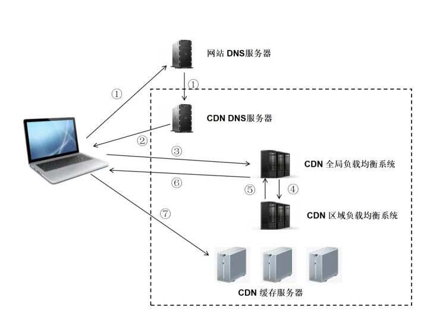

# 性能优化

## 1. tree shaking
中文（摇树），webpack构建优化中重要一环。摇树用于清除我们项目中的一些无用代码，它依赖于ES中的模块语法。
比如日常使用lodash的时候
```js
import _ from 'lodash'
```
如果如上引用lodash库，在构建包的时候是会把整个lodash包打入到我们的bundle包中的。

```js
import _isEmpty from 'lodash/isEmpty';
```
如果如上引用lodash库，在构建包的时候只会把isEmpty这个方法抽离出来再打入到我们的bundle包中。  
这样的化就会大大减少我们包的size。所以在日常引用第三方库的时候，需要注意导入的方式。

如何开启摇树  
在webpack4.x 中默认对tree-shaking进行了支持。 在webpack2.x 中使用tree-shaking：[传送门](https://zhuanlan.zhihu.com/p/28725181)

## 2. split chunks
中文（分包）
在没配置任何东西的情况下，webpack 4 就智能的帮你做了代码分包。入口文件依赖的文件都被打包进了main.js，那些大于 30kb 的第三方包，如：echarts、xlsx、dropzone等都被单独打包成了一个个独立 bundle。
其它被我们设置了异步加载的页面或者组件变成了一个个chunk，也就是被打包成独立的bundle。
它内置的代码分割策略是这样的：
- 新的 chunk 是否被共享或者是来自 node_modules 的模块
- 新的 chunk 体积在压缩之前是否大于 30kb
- 按需加载 chunk 的并发请求数量小于等于 5 个
- 页面初始加载时的并发请求数量小于等于 3 个
大家可以根据自己的项目环境来更改配置。配置代码如下：

```js
splitChunks({
  cacheGroups: {
    vendors: {
      name: `chunk-vendors`,
      test: /[\\/]node_modules[\\/]/,
      priority: -10,
      chunks: 'initial',
    },
    dll: {
      name: `chunk-dll`,
      test: /[\\/]bizcharts|[\\/]\@antv[\\/]data-set/,
      priority: 15,
      chunks: 'all',
      reuseExistingChunk: true
    },
    common: {
      name: `chunk-common`,
      minChunks: 2,
      priority: -20,
      chunks: 'all',
      reuseExistingChunk: true
    },
  }
})
```
没有使用webpack4.x版本的项目，依然可以通过**按需加载**的形式进行分包，使得我们的包分散开，提升加载性能。  
按需加载也是以前分包的重要手段之一  
这里推荐一篇非常好的文章：[webpack如何使用按需加载](https://juejin.cn/post/6844903718387875847)

## 3. 拆包
与3.2的分包不同。大家可能没发现，上面2.3的bundle包解析中有个有趣的现象，上面项目的技术栈是react，但是bundle包中并没有react、react-dom、react-router等。  
因为把这些插件“拆”开了。并没有一起打在bundle中。而是放在了CDN上。下面我举一个例子来解释一下。  
假设：原本bundle包为2M，一次请求拉取。拆分为 bundle（1M） + react桶（CDN）（1M） 两次请求并发拉取。  
从这个角度来看，1+1的模式拉取资源更快。  
换一个角度来说，全量部署项目的情况，每次部署bundle包都将重新拉取。比较浪费资源。react桶的方式可以命中强缓存，这样的化，就算全量部署也只需要重新拉取左侧1M的bundle包即可，节省了服务器资源。优化了加载速度。  
注意：在本地开发过程中，react等资源建议不要引入CDN，开发过程中刷新频繁，会增加CDN服务其压力，走本地就好。  

## 4. gzip
服务端配置gzip压缩后可大大缩减资源大小。  
Nginx配置方式  
```
http {
  gzip on;
  gzip_buffers 32 4K;
  gzip_comp_level 6;
  gzip_min_length 100;
  gzip_types application/javascript text/css text/xml;
  gzip_disable "MSIE [1-6]\.";
  gzip_vary on;
}
```

## 5. 图片压缩
开发中比较重要的一个环节，我司自己的图床工具是自带压缩功能的，压缩后直接上传到CDN上。
如果公司没有图床工具，我们该如何压缩图片呢？我推荐几种我常用的方式
- 智图压缩 (百度很难搜到官网了，免费、批量、好用)
- [tinypng](https://tinypng.com/)(免费、批量、速度块)
- fireworks工具压缩像素点和尺寸 (自己动手，掌握尺度)
- 找UI压缩后发给你
图片压缩是常用的手法，因为设备像素点的关系，UI给予的图片一般都是 x2，x4的，所以压缩就非常有必要。

## 6. 图片分割
如果页面中有一张效果图，比如真机渲染图，UI手拿着刀不让你压缩。这时候不妨考虑一下分割图片。  
建议单张土图片的大小不要超过100k，我们在分割完图片后，通过布局再拼接在一起。可以图片加载效率。  
这里注意一点，分割后的每张图片一定要给height，否则网速慢的情况下样式会塌陷。  

## 7. sprite
南方叫精灵图，北方叫雪碧图。这个现象就很有趣。  
在网站中有很多小图片的时候，一定要把这些小图片合并为一张大的图片，然后通过background分割到需要展示的图片。  
这样的好处是什么呢？先来普及一个规则  
浏览器请求资源的时候，同源域名请求资源的时候有最大并发限制，chrome为6个，就比如你的页面上有10个相同CDN域名小图片，那么需要发起10次请求去拉取，分两次并发。第一次并发请求回来后，发起第二次并发。  
如果你把10个小图片合并为一张大图片的画，那么只用一次请求即可拉取下来10个小图片的资源。减少服务器压力，减少并发，减少请求次数。  

## 8. 懒加载
懒加载也叫延迟加载，指的是在长网页中延迟加载图像，是一种非常好的优化网页性能的方式。
当可视区域没有滚到资源需要加载的地方时候，可视区域外的资源就不会加载。
可以减少服务器负载，常适用于图片很多，页面较长的业务场景中。
如何使用懒加载呢？
- [图片懒加载](https://juejin.cn/post/6844903688390049800)
- [layzr.js](https://github.com/callmecavs/layzr.js)

## 9. CDN

### 1. CDN的概念
CDN（Content Delivery Network，内容分发网络）是指一种通过互联网互相连接的电脑网络系统，利用最靠近每位用户的服务器，更快、更可靠地将音乐、图片、视频、应用程序及其他文件发送给用户，来提供高性能、可扩展性及低成本的网络内容传递给用户。

典型的CDN系统由下面三个部分组成：

  - 分发服务系统：最基本的工作单元就是Cache设备，cache（边缘cache）负责直接响应最终用户的访问请求，把缓存在本地的内容快速地提供给用户。同时cache还负责与源站点进行内容同步，把更新的内容以及本地没有的内容从源站点获取并保存在本地。Cache设备的数量、规模、总服务能力是衡量一个CDN系统服务能力的最基本的指标。
  - 负载均衡系统：主要功能是负责对所有发起服务请求的用户进行访问调度，确定提供给用户的最终实际访问地址。两级调度体系分为全局负载均衡（GSLB）和本地负载均衡（SLB）。全局负载均衡主要根据用户就近性原则，通过对每个服务节点进行“最优”判断，确定向用户提供服务的cache的物理位置。本地负载均衡主要负责节点内部的设备负载均衡
  - 运营管理系统：运营管理系统分为运营管理和网络管理子系统，负责处理业务层面的与外界系统交互所必须的收集、整理、交付工作，包含客户管理、产品管理、计费管理、统计分析等功能。

### 2. CDN的作用
CDN一般会用来托管Web资源（包括文本、图片和脚本等），可供下载的资源（媒体文件、软件、文档等），应用程序（门户网站等）。使用CDN来加速这些资源的访问。

1. 在性能方面，引入CDN的作用在于：
	- 用户收到的内容来自最近的数据中心，延迟更低，内容加载更快
	- 部分资源请求分配给了CDN，减少了服务器的负载

2. 在安全方面，CDN有助于防御DDoS、MITM等网络攻击：
	- 针对DDoS：通过监控分析异常流量，限制其请求频率
	- 针对MITM：从源服务器到 CDN 节点到 ISP（Internet Service Provider），全链路 HTTPS 通信

除此之外，CDN作为一种基础的云服务，同样具有资源托管、按需扩展（能够应对流量高峰）等方面的优势。

### 3. CDN的原理
CDN和DNS有着密不可分的联系，先来看一下DNS的解析域名过程，在浏览器输入 www.test.com 的解析过程如下：

1. ）检查浏览器缓存

2. ）检查操作系统缓存，常见的如hosts文件

3. ）检查路由器缓存

4. ）如果前几步都没没找到，会向ISP(网络服务提供商)的LDNS服务器查询

5. ）如果LDNS服务器没找到，会向根域名服务器(Root Server)请求解析，分为以下几步：
	- 根服务器返回顶级域名(TLD)服务器如.com，.cn，.org等的地址，该例子中会返回.com的地址
	- 接着向顶级域名服务器发送请求，然后会返回次级域名(SLD)服务器的地址，本例子会返回.test的地址
	- 接着向次级域名服务器发送请求，然后会返回通过域名查询到的目标IP，本例子会返回www.test.com的地址
	- Local DNS Server会缓存结果，并返回给用户，缓存在系统中

**CDN的工作原理：**
1. ）用户未使用CDN缓存资源的过程：
	- a. 浏览器通过DNS对域名进行解析（就是上面的DNS解析过程），依次得到此域名对应的IP地址
	- b. 浏览器根据得到的IP地址，向域名的服务主机发送数据请求
	- c. 服务器向浏览器返回响应数据

2. ）用户使用CDN缓存资源的过程：
	- a. 对于点击的数据的URL，经过本地DNS系统的解析，发现该URL对应的是一个CDN专用的DNS服务器，DNS系统就会将域名解析权交给CNAME指向的CDN专用的DNS服务器。
	- b. CND专用DNS服务器将CND的全局负载均衡设备IP地址返回给用户
	- c. 用户向CDN的全局负载均衡设备发起数据请求
	- d. CDN的全局负载均衡设备根据用户的IP地址，以及用户请求的内容URL，选择一台用户所属区域的区域负载均衡设备，告诉用户向这台设备发起请求
	- e. 区域负载均衡设备选择一台合适的缓存服务器来提供服务，将该缓存服务器的IP地址返回给全局负载均衡设备
	- f. 全局负载均衡设备把服务器的IP地址返回给用户
	- g. 用户向该缓存服务器发起请求，缓存服务器响应用户的请求，将用户所需内容发送至用户终端。

如果缓存服务器没有用户想要的内容，那么缓存服务器就会向它的上一级缓存服务器请求内容，以此类推，直到获取到需要的资源。最后如果还是没有，就会回到自己的服务器去获取资源。



CNAME（意为：别名）：在域名解析中，实际上解析出来的指定域名对应的IP地址，或者该域名的一个CNAME，然后再根据这个CNAME来查找对应的IP地址。

### 4. CDN的使用场景
- **使用第三方的CDN服务**：如果想要开源一些项目，可以使用第三方的CDN服务
- **使用CDN进行静态资源的缓存**：将自己网站的静态资源放在CDN上，比如js、css、图片等。可以将整个项目放在CDN上，完成一键部署。
- **直播传送**：直播本质上是使用流媒体进行传送，CDN也是支持流媒体传送的，所以直播完全可以使用CDN来提高访问速度。CDN在处理流媒体的时候与处理普通静态文件有所不同，普通文件如果在边缘节点没有找到的话，就会去上一层接着寻找，但是流媒体本身数据量就非常大，如果使用回源的方式，必然会带来性能问题，所以流媒体一般采用的都是主动推送的方式来进行。

## 10. web worker
Web Worker 的作用，就是为 JavaScript 创造多线程环境，允许主线程创建 Worker 线程，将一些任务分配给后者运行。在主线程运行的同时，Worker 线程在后台运行，两者互不干扰。等到 Worker 线程完成计算任务，再把结果返回给主线程。这样的好处是，一些计算密集型或高延迟的任务，被 Worker 线程负担了，主线程（通常负责 UI 交互）就会很流畅，不会被阻塞或拖慢。

合理实用web worker可以优化复杂计算任务。这里直接抛阮一峰的入门文章：[传送门](https://www.ruanyifeng.com/blog/2018/07/web-worker.html)

## 11. 缓存
缓存的原理就是更快读写的存储介质+减少IO+减少CPU计算=性能优化。而性能优化的第一定律就是：优先考虑使用缓存。

缓存的主要手段有：浏览器缓存、CDN、反向代理、本地缓存、分布式缓存、数据库缓存。

## 12. GPU渲染
每个网页或多或少都涉及到一些CSS动画，通常简单的动画对于性能的影响微乎其微，然而如果涉及到稍显复杂的动画，不当的处理方式会使性能问题变得十分突出。  
像Chrome, FireFox, Safari, IE9+和最新版本的Opera都支持GPU加速，当它们检测到页面中某个DOM元素应用了某些CSS规则时就会开启。  
虽然我们可能不想对元素应用3D变换，可我们一样可以开启3D引擎。例如我们可以用transform: translateZ(0) 来开启GPU加速。  
只对我们需要实现动画效果的元素应用以上方法，如果仅仅为了开启硬件加速而随便乱用，那是不合理的。  

## 13. Ajax可缓存
Ajax在发送的数据成功后，为了提高页面的响应速度和用户体验，会把请求的URL和返回的响应结果保存在缓存内，当下一次调用Ajax发送相同的请求（URL和参数完全相同）时，它就会直接从缓存中拿数据。

在进行Ajax请求的时候，可以选择尽量使用get方法，这样可以使用客户端的缓存，提高请求速度。

## 14. Resource Hints
Resource Hints(资源预加载)是非常好的一种性能优化方法，可以大大降低页面加载时间，给用户更加流畅的用户体验。  
现代浏览器使用大量预测优化技术来预测用户行为和意图，这些技术有预连接、资源与获取、资源预渲染等。  
Resource Hints 的思路有如下两个：
- 当前将要获取资源的列表
- 通过当前页面或应用的状态、用户历史行为或 session 预测用户行为及必需的资源
实现Resource Hints的方法有很多种，可分为基于 link 标签的 DNS-prefetch、subresource、preload、 prefetch、preconnect、prerender，和本地存储 localStorage。

## 15. SSR
渲染过程在服务器端完成，最终的渲染结果 HTML 页面通过 HTTP 协议发送给客户端，又被认为是‘同构'或‘通用'，如果你的项目有大量的detail页面，相互特别频繁，建议选择服务端渲染。  
服务端渲染(SSR)除了SEO还有很多时候用作首屏优化，加快首屏速度，提高用户体验。但是对服务器有要求，网络传输数据量大，占用部分服务器运算资源。  
Vue的Nuxt.js和React的next.js都是服务端渲染的方法。  